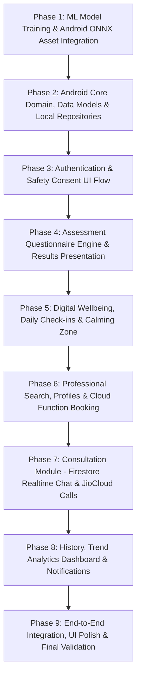

# MindGuard AI — Comprehensive Phase-by-Phase Master Implementation Plan

## 1. Project Overview & Context
MindGuard AI is an AI-integrated native Android mobile application for early preliminary mental health risk screening (Depression, Anxiety, Stress) and care navigation (Calming Zone, Professional Directory, Appointment Booking, Realtime Chat, and JioCloud Video/Audio Teleconsultation).

### Architectural Stack
- **Android Frontend**: Kotlin + XML Layouts + Navigation Component + ViewModel/Coroutines (No Jetpack Compose, No Flutter/React Native).
- **Backend & Realtime Data**: Firebase only (Firebase Auth, Cloud Firestore, Firebase Storage, Firebase Cloud Messaging, App Check). No separate Express/Node server.
- **Serverless Operations**: JavaScript Firebase Cloud Functions (trusted atomic booking, professional verification, reminders, data cleanup).
- **Machine Learning**: Python (training Random Forest classifier with 36 questionnaire parameters) exported to ONNX; executed on-device using ONNX Runtime on Android.
- **Teleconsultation**: JioCloud SDK for Video/Audio calls; Cloud Firestore for real-time 1-on-1 consultation chat.

---

## 2. Audit of Existing Coded Assets (To Be Preserved)

| Component | Existing File / Asset | Status & Preservation Strategy |
| :--- | :--- | :--- |
| **Documentation** | `docs/*.md` (requirements, architecture, questionnaire, ml, security, api-functions, testing) | **100% Preserved**. Retained as reference specifications. |
| **ML Pipeline** | `ml/src/schema.py`, `preprocess.py`, `train.py`, `export_onnx.py` | **100% Preserved**. 36-feature schema across 6 categories, Likert mapper, Random Forest trainer, and ONNX exporter with parity verification. |
| **Cloud Functions** | `functions/index.js`, `package.json`, `modules/*.js` (`appointments`, `professionals`, `consultations`, `notifications`, `cleanup`) | **100% Preserved**. Atomic slot reservation, cancellation, reschedule, verification, reminder jobs. |
| **Firebase Security** | `firebase/firestore.rules`, `storage.rules`, `firestore.indexes.json` | **100% Preserved**. Role-based access control, user ownership, and slot validation rules. |
| **Android ML Layer** | `ml/OnnxModelRunner.kt`, `FeatureMapper.kt`, `PredictionResult.kt`, `ModelManager.kt` | **100% Preserved**. On-device ONNX inference engine, feature vector builder, and category score mapper. |
| **Android Base** | `MindGuardApp.kt`, `MainActivity.kt`, `AndroidManifest.xml`, Gradle configuration | **100% Preserved & Extended**. Base application setup and navigation host. |

---

## 3. Step-by-Step Phase Roadmap

The remaining development is decomposed into small, modular, and testable phases:

---

### **Phase 1: ML Model Training & Android ONNX Asset Integration**
- **Objective**: Generate the dataset, train the Random Forest model in Python, export the validated `model_v1.onnx`, and bundle it into `android/app/src/main/assets/`.
- **Tasks**:
  1. Generate synthetic 36-feature dataset aligned with `schema.py` (`ml/data/processed/questionnaire_dataset.csv`).
  2. Execute `train.py` to train Random Forest (`rf_v1.pkl`) and record classification metrics (Accuracy, F1-score, Precision, Recall).
  3. Run `export_onnx.py` to create `model_v1.onnx` and verify inference numerical parity.
  4. Copy `model_v1.onnx` into `android/app/src/main/assets/model_v1.onnx` and question bank JSON into assets.
- **Deliverables & Verification**:
  - `model_v1.onnx` in assets.
  - Python test verifying ONNX parity with scikit-learn.

---

### **Phase 2: Android Core Domain Models, Enums & Local Repositories**
- **Objective**: Implement clean data layer contracts, Firestore entity mappings, and repository interfaces.
- **Tasks**:
  1. Create data models in `com.mindguard.ai.data.model`:
     - `User`, `Professional`, `AssessmentResult`, `Question`, `QuestionCategory`, `DailyCheckIn`, `DigitalWellbeingMetric`, `Appointment`, `ConsultationSession`, `ChatMessage`.
  2. Implement Repositories in `com.mindguard.ai.data.repository`:
     - `AuthRepository`, `AssessmentRepository`, `WellbeingRepository`, `ProfessionalRepository`, `AppointmentRepository`, `ConsultationRepository`.
  3. Create Dependency Injection / Service Locator singletons (`di/AppContainer.kt`).
- **Deliverables & Verification**:
  - All data classes and repository interfaces compiling without errors.

---

### **Phase 3: Authentication & Safety Consent Flow (UI & Firebase Auth)**
- **Objective**: Build the entry experience with authentication, safety warnings, and informed consent.
- **Tasks**:
  1. UI Layouts & ViewModels for:
     - Splash screen (`fragment_splash.xml`)
     - Onboarding carousel (`fragment_onboarding.xml`)
     - Login & Register screens (`fragment_login.xml`, `fragment_register.xml`)
     - Forgot Password (`fragment_forgot_password.xml`)
     - Mandatory Safety Disclaimer & Consent Screen (`fragment_consent.xml`)
  2. Wire up Firebase Authentication (Email/Password, user profile creation in Firestore).
  3. Navigation graph setup with auth gate ensuring unauthenticated or unconsented users cannot bypass.
- **Deliverables & Verification**:
  - User can register, login, accept consent, and navigate to the dashboard.

---

### **Phase 4: Questionnaire Engine & ML Results Presentation**
- **Objective**: Implement the category-by-category questionnaire UX, on-device ONNX inference, and non-diagnostic risk result display.
- **Tasks**:
  1. Questionnaire UI:
     - `fragment_assessment_intro.xml`
     - `fragment_question_page.xml` (supports 4–6 Likert questions per page with progress indicator)
     - `fragment_assessment_review.xml`
  2. Assessment ViewModel connecting user answers → `FeatureMapper` → `OnnxModelRunner` → `PredictionResult`.
  3. Results UI (`fragment_assessment_result.xml`):
     - Display Low / Moderate / High preliminary indicators with safe, non-diagnostic wording.
     - Breakdown by category (Mood, Anxiety, Stress, Sleep, Cognitive, Social).
     - Save assessment record to Firestore (`users/{uid}/assessments`).
- **Deliverables & Verification**:
  - Full 36-question walkthrough executes on-device ONNX inference and renders categorized indicators.

---

### **Phase 5: Digital Wellbeing, Daily Check-Ins & Calming Zone**
- **Objective**: Implement self-care modules, daily tracking, rule-based wellbeing engine, and grounding exercises.
- **Tasks**:
  1. Daily Check-in Modal (`fragment_daily_checkin.xml`): 1–5 scale for Mood, Energy, Stress, Sleep.
  2. Digital Wellbeing Insights (`fragment_digital_wellbeing.xml`): Screen-time and usage guidance heuristics.
  3. Calming Zone (`fragment_calming_zone.xml`):
     - 60s & 120s Guided Box Breathing animation with custom countdown timer (`fragment_breathing.xml`).
     - 5-4-3-2-1 Sensory Grounding exercise guide.
     - Mindful reflection audio/visual cards.
  4. Rule-based Recommendation Engine matching assessment scores + check-ins to tailored guidance cards.
- **Deliverables & Verification**:
  - Interactive breathing exercise animation runs smoothly; check-in records sync to Firestore.

---

### **Phase 6: Professional Search, Profiles & Cloud Function Booking**
- **Objective**: Enable discovery of verified mental health professionals and atomic slot scheduling.
- **Tasks**:
  1. Professional Directory (`fragment_professionals_list.xml`):
     - Search bar, filter by specialty (Clinical Psychologist, Psychiatrist, Counselor), language, and availability.
  2. Professional Detail Screen (`fragment_professional_detail.xml`):
     - Bio, credentials, verified badge, available date/time slot picker.
  3. Appointment Booking Screen & Confirmation (`fragment_booking.xml`, `fragment_booking_confirmation.xml`):
     - Trigger JavaScript Firebase Cloud Function `createAppointment` for server-side atomic reservation.
     - Handling real-time slot locking and error scenarios (slot taken, network drop).
- **Deliverables & Verification**:
  - Booking flow triggers Cloud Function, reserves slot in Firestore, and updates appointment list.

---

### **Phase 7: Consultation Module (Firestore Realtime Chat & JioCloud Video/Audio)**
- **Objective**: Build the live consultation experience for scheduled appointments.
- **Tasks**:
  1. Appointments Dashboard (`fragment_appointments.xml`): Upcoming and past consultation tabs.
  2. Realtime Chat Consultation (`fragment_chat.xml`):
     - Firestore realtime listener on `consultation_sessions/{sessionId}/messages`.
     - Secure message sending, timestamps, and active status indicators.
  3. JioCloud Video/Audio Interface (`fragment_call.xml`):
     - Modular `ConsultationCallManager` abstraction.
     - Camera toggle, mic mute, speaker toggle, end call lifecycle, and session metadata updates.
- **Deliverables & Verification**:
  - Live chat updates in real-time; video/audio consultation interface connects properly.

---

### **Phase 8: History, Analytics Dashboard & Cloud Messaging**
- **Objective**: Provide comprehensive trend visualization, historical review, and push notification triggers.
- **Tasks**:
  1. Home Dashboard (`fragment_home.xml`): Unified view with latest risk status, quick check-in card, daily tip, quick action shortcuts.
  2. History & Trends (`fragment_history.xml`, `fragment_trends.xml`):
     - Assessment history list and detail view.
     - Visual trend charts (Mood, Stress, and Anxiety trends over time).
  3. Firebase Cloud Messaging (FCM) Integration:
     - `MindGuardFirebaseMessagingService.kt` for appointment confirmations, upcoming session reminders, and wellbeing nudges.
- **Deliverables & Verification**:
  - Trends chart renders historical records; FCM handles incoming payloads and displays notification alerts.

---

### **Phase 9: End-to-End Integration, Security Audit & Final Polish**
- **Objective**: Full end-to-end verification, accessibility compliance, theme consistency, and release readiness.
- **Tasks**:
  1. Run complete user journey: Registration → Assessment → ML Inference → Guidance → Calming Zone → Booking → Consultation → Trend Review.
  2. Verify Firestore Security Rules against emulator to ensure strict data privacy.
  3. Dark mode/light mode theme tuning, contrast checks, and error-handling edge cases.
  4. Final documentation update and walkthrough recording.
- **Deliverables & Verification**:
  - Full app build and test pass without regressions.

---

## 4. Execution Protocol
We will proceed strictly **one phase at a time**:
1. At the beginning of each phase, review the specific scope and files to be created/updated.
2. Execute the phase implementation cleanly.
3. Test and verify all deliverables for that phase.
4. Provide a structured progress report summarizing completed items, files changed, and ready status before moving to the next phase.
